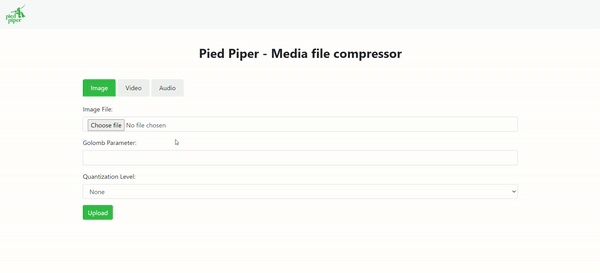

# Pied Piper: Multimedia Codec Tester




Pied Piper is a web-based server application for testing multimedia codecs, including image, video, and audio codecs. The application allows users to upload files, apply compression using custom Golomb parameters and quantization levels, and then view the results, including compression rates, file sizes, and PSNR (Peak Signal-to-Noise Ratio). Users can also download the decoded files for verification.

## Features
- Supports **image files** in `.ppm` format, **video files** in `.y4m` format, and **audio files** in `.wav` format.
- Calculates:
  - Original file size.
  - Encoded file size.
  - Compression rate (percentage reduction in size).
  - PSNR value (for image and video codecs).
- Provides downloadable decoded files.

---


## Setup

### With Docker


#### 1. Clone the Repository
```bash
git clone <repo_url>
cd <repo_name>
```

#### 2. Build the Docker Image
```bash
docker build -t pied-piper .
```

#### 3. Run the Docker Image
```bash
docker run -p 5000:5000 pied-piper
```

### Manual Setup

#### 0. Install required dependencies:
1. **Python**
2. **OpenCV**
3. **libsndfile**
4. **ffmpeg**
5. **cmake**
6. **make**

On Ubuntu, the installation looks like this:
```bash
sudo apt-get install -y \
    build-essential \
    ffmpeg \
    cmake \
    libopencv-dev \
    libsndfile1-dev \
    python3 \
    python3-pip
```

#### 1. Clone the Repository
```bash
git clone <repo_url>
cd <repo_name>
```

#### 2. Install Python Dependencies
Create a virtual environment (optional) and install Flask:
```bash
python -m venv venv
source venv/bin/activate
pip install -r server/requirements.txt
```

#### 3. Build the Codec Binaries
Navigate to the `build/` directory and compile the binaries:
```bash
mkdir build
cd build
cmake ..
make
```
Ensure the following binaries are created:
- `imageTest`
- `videoTest`
- `audioTest`

#### 4. Run the Server
Navigate to the `server` folder and start the server:
```bash
cd ../server
python server.py
```

---

## Usage

### Uploading Files
1. Open the browser and navigate to [localhost:5000](localhost:5000).
2. Choose the media type (image, video or audio).
3. Upload the media file.
4. Enter the required parameters:
   - **Golomb Parameter**: Compression parameter.
   - **Quantization Level**: (Optional) Specify a quantization level for lossy compression.
5. Submit the form.

### Viewing Results
After submission, the server will:
- Process the file using the respective codec.
- Display results including:
  - Original file size.
  - Encoded file size.
  - Compression rate.
  - PSNR (if applicable).
- Provide a link to download the decoded file.

---

## API Endpoints

### 1. Image Codec
**Endpoint**: `/image`
**Method**: `POST`

#### Parameters:
- `file`: Image file in `.ppm` format.
- `golomb_param`: Compression parameter.
- `quant_level` (optional): Quantization level.

### 2. Video Codec
**Endpoint**: `/video`
**Method**: `POST`

#### Parameters:
- `file`: Video file in `.y4m` format.
- `golomb_param`: Compression parameter.
- `quant_level` (optional): Quantization level.

### 3. Audio Codec
**Endpoint**: `/audio`
**Method**: `POST`

#### Parameters:
- `file`: Audio file in `.wav` format.
- `golomb_param` (optional): Compression parameter. If not present, the codec
will dynamically choose the best golomb parameter `m`, for each block.
